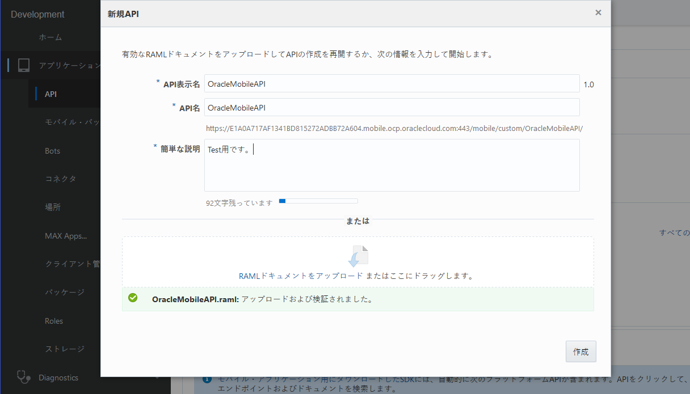
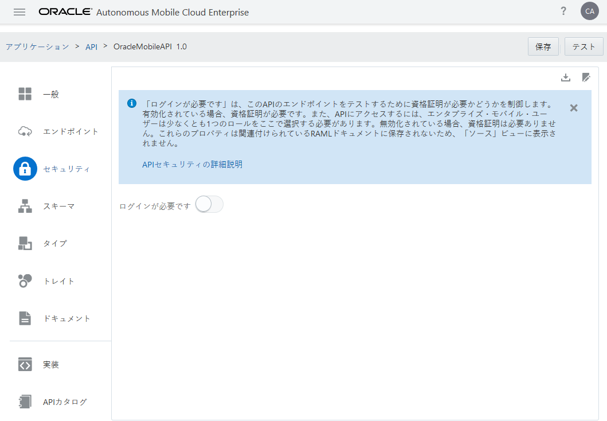
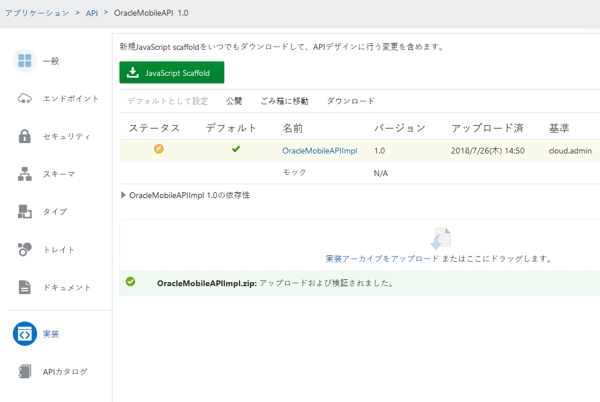
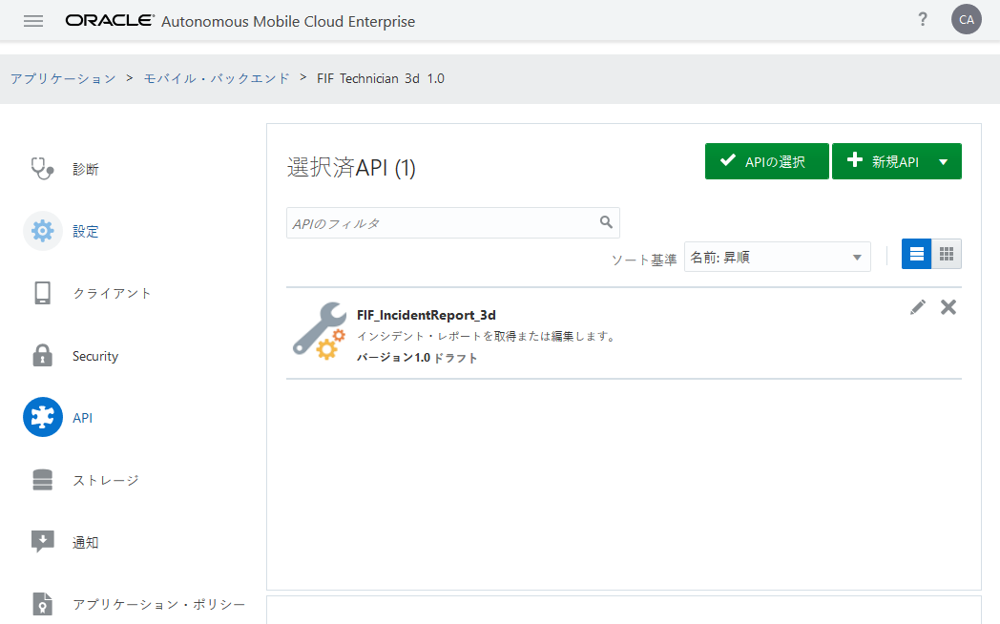
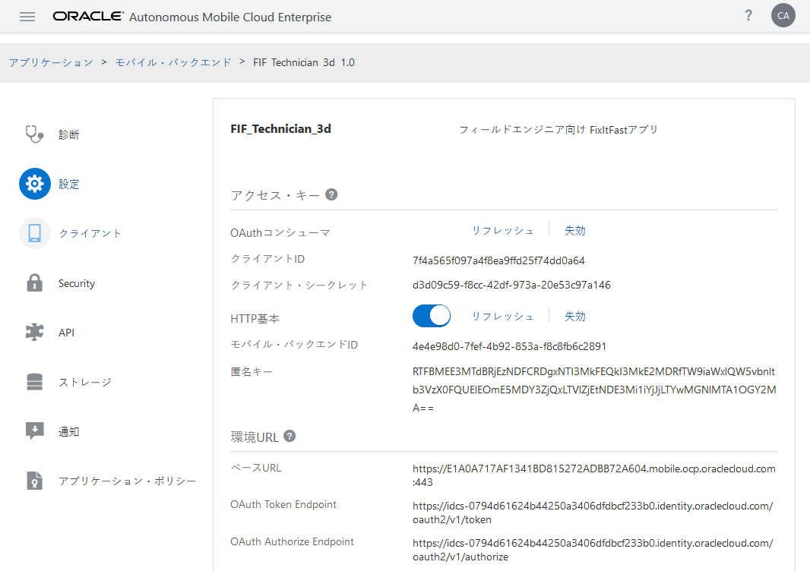

# カスタムコードテストツール編

## カスタムコードテストツールについて

Oracle Autonomous Mobile Cloud Enterprise、バージョン18.1.1.0

2018-01-10

[こちらからツールをダウンロードしてください。](http://www.oracle.com/technetwork/topics/cloud/downloads/amce-downloads-4478270.html)

Oracle Autonomous Mobile Cloud Enterprise（AMCe）には、次のようなカスタム・コード・テスト・ツールが用意されています。

ローカルマシン上のカスタムAPI実装をテストしてデバッグします。
これらのAPI実装をパッケージ化し、コマンドラインからAMCeにアップロードします。

## このツールは何ですか？

ツール・セットは次のもので構成されます。

* ローカルカスタムコードコンテナを起動し、テストを実行し、API実装をAMCeにデプロイするためのコマンドラインツールを含むnpmモジュール（omce-tools）。
* ローカルマシン上に実行されるノード・コンテナからAMCe内で実行されるコンテナへのAMCe APIコールをプロキシするためのAPI（OracleMobileAPI）。このAPIをAMCeにアップロードし、使用したいAPIを含むバックエンドに関連付ける必要があります。

## 前提条件

* Linux環境
* Node.jsのローカルインストール（バージョン6.10以降）
* AMCeのインスタンスにおける開発者のロール

## ツールの設定

### omce-toolsのインストール

1. マシン上でターミナルウィンドウを開き、omce-toolsディレクトリに移動します。

2. `npm install -g`を実行します。

3. ツールが正しくインストールされたことを確認するには、`omce-test --version`を実行します。18.1.1を返します。

```
[root@localhost omce-tools]# node --version
v10.7.0
[root@localhost omce-tools]# npm install -g
npm WARN deprecated is-my-json-valid@2.15.0: catastrophic backtracking in regexes could potentially lead to REDOS attack, upgrade to 2.17.2 as soon as possible
npm WARN deprecated node-uuid@1.4.7: Use uuid module instead
/usr/bin/omce-ccc -> /usr/lib/node_modules/@oracle-mobile/omce-tools/omce-ccc.js
/usr/bin/omce-deploy -> /usr/lib/node_modules/@oracle-mobile/omce-tools/omce-deploy.js
/usr/bin/omce-test -> /usr/lib/node_modules/@oracle-mobile/omce-tools/omce-test.js
+ @oracle-mobile/omce-tools@18.1.1
added 189 packages from 130 contributors in 178.224s
[root@localhost omce-tools]# omce-test --version
18.1.1
```

### OracleMobileAPIをAMCeに追加する

1. AMCeの「**アプリケーション**」タブで、「**API**」ページを開き、「**新規API**」をクリックして、「**API**」 を選択します。

2. 「**RAMLドキュメントをアップロード**」をクリックし、システム上の*OracleMobileAPI.raml*ファイルにナビゲートし、「**開く**」をクリックします。

3. APIの簡単な説明を入力し、「**作成**」をクリックします。

   

4. 「**セキュリティ**」タブをクリックし、「ログインが必要です」を「OFF」にします。

   

5. 「**保存**」をクリックします。

6. 「**実装**」タブをクリックし、システムから*OracleMobileAPIImpl.zip*をアップロードし、「**保存**」をクリックします。

   

## API実装のテスト

### テスト用にAPIを設定する

1. 必要に応じて、AMCeでAPIを作成し、エンドポイントとサンプルのリクエスト/レスポンスデータを追加します。

2. AMCeでAPIをバックエンドに関連付けます。（AMCeの「**アプリケーション**」タブで、「モバイル・バックエンド」ページを開き、使用するバックエンドを選択して「開く」ボタンをクリックし、バックエンドの「API」タブをクリックして、「APIの選択」ボタンをクリックします。）

   

3. OracleMobileAPIを同じバックエンドに関連付けます。

4. テストしたいAPIのJavaScriptスカフォールドをダウンロードします。（APIを開き、「実装」タブをクリックし、「JavaScript Scaffold」ボタンをクリックします）。

5. ダウンロードしたフォルダを解凍し、その内容を確認する。ディレクトリには、次のファイルが含まれている必要があります。
    * package.json - モジュールのマニフェスト
    * *api name* .js - APIの実装
    * *api name*.raml - RAML形式のAPI定義
    * swagger.json - Swagger形式のAPI定義
    * toolsConfig.json - バックエンド環境や認証情報、API、AMCeエンドポイント、テスト定義など、このツールが必要とするメタデータが含まれています
    * samples.txt
    * ReadMe.md

### テストのためのAPI実装の設定

1. ターミナルウィンドウで、ダウンロードしたscaffoldを含むディレクトリに移動します。

2. `npm install`を実行します。

3. AMCeインスタンス、バックエンドおよび認可情報を含めるように、API実装の*toolsConfig.json*ファイルを更新します。

    * *baseUrl*はAMCeインスタンスのベースURLです。この値は必須で、AMCeの「アプリケーション -> モバイル・バックエンド -> 使用するバックエンドを選択して「開く」ボタンをクリック -> 設定」ページにあります。
    * *tokenEndpoint*は、テナントのIDCS OAuthトークンエンドポイントです。この値は必須で、baseUrlと同様に設定ページにあります。
    * omce-cccを使用してAPI実装からAMCeインスタンスへのAPI呼び出しを承認するには、*backend*プロパティが必要です。バックエンドの設定ページからバックエンド情報を取得できます。（AMCEで「アプリケーション」タブで、「モバイル・バックエンド」をクリックして、APIを使用しているバックエンドを選択し、「開く」ボタンをクリックし、設定タブをクリックします。）。以下のプロパティが必要です。
        * backend.backendId
        * backend.authorization.anonymousKey
        * backend.authorization.clientId（オプション、omce-testを使用してテストを送信する際にoauthセキュリティを使用する必要があります）
        * backend.authorization.clientSecret（オプション、omce-testを使用してテストを送信する際にoauthセキュリティを使用する必要があります）
    * omce-deployなどのAMCeパブリックツールのAPIを使用するコマンドでは、*tools*プロパティが必要です。以下のプロパティが必要です。
        * tools.authorization.clientId
        * tools.authorization.clientSecret

   

デフォルトでは、toolsConfig.jsonがAPI実装と同じディレクトリにあるか、または同じディレクトリにあることを前提としています。toolsConfig.jsonを別のディレクトリに移動する場合、modulesLocationを使用してtoolsConfig.jsonに API実装の場所を指定する必要があります。

他の可能なtoolsConfig.jsonプロパティー（テストのフォーマットを含む）は、resource / configMetadata.jsonファイルに記述されています。

### ローカルコンテナの起動

このコマンドは、API実装を実行するノードコンテナを起動します（toolsConfig.jsonによって識別されます）。コンテナは、--debugオプションの有無にかかわらず起動できます。--debugオプションを指定してコンテナを起動すると、Google Chromeでデバッグセッションを開くために使用できるURLが取得されます。

```
omce-ccc <path to toolsConfig.json> [--debug] [--verbose]
```

```
[root@localhost u01]# omce-ccc /u01/oracle/fif_api/fif_incidentreport_3d/toolsConfig.json --debug
Debugger listening on ws://127.0.0.1:9229/41029610-8ed2-4576-86cc-6c417f9f2b5b
For help, see: https://nodejs.org/en/docs/inspector
Ping OracleMobileAPI to verify that OracleMobileAPI-uri and authorization are correct.
OracleMobileAPI ping succeeded!
The Node server is listening at port 4000
```

### コンテナへのAPIコールの作成

コンテナが実行されたら、omce-test、cURL、Postman、または他のRESTクライアントを使用して、コンテナにリクエストを送信できます。

デフォルトでは、コンテナはポート4000上で実行されます（これはresource / configMetadata.jsonファイルで変更できます）。

cURLを使用すると、単純なコマンドは次のようになります。

```
$ curl -X GET http://localhost:4000/mobile/custom/<api-name>/<api-version>/<resource-path>
```
