## モバイル・バックエンドの作成

ここでは、モバイル・バックエンドを作成します。また、MCSのサービス・コンソールが提供しているモバイル・バックエンドの構成のための機能について一通り説明します。

**Step-1** MCSのサービス・コンソールにログインします。「ホーム」ページが表示されたら、画面左上にあるハンバーガー・アイコンをクリックします。

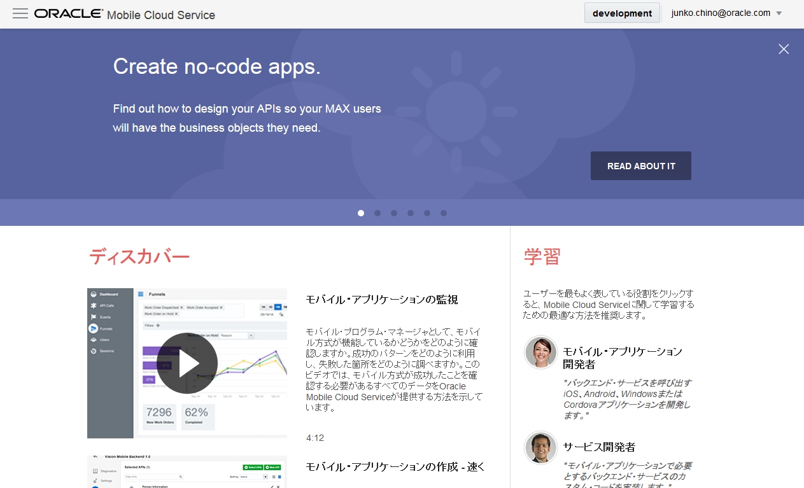

**Step-2** 画面の左側にメニュー・パネルが表示されます。「アプリケーション」をクリックして、「アプリケーション」ページを開きます。

**Step-3** 「アプリケーション」ページの左上にある「モバイル・バックエンド」をクリックします。

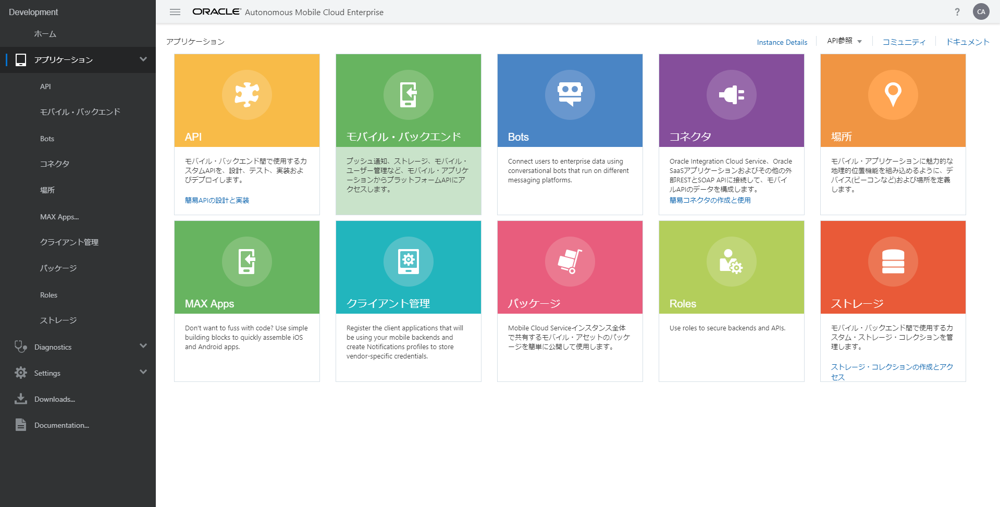

**Step-4** 「モバイル・バックエンド」ページが表示されます。「新規モバイル・バックエンド」ボタンをクリックします。

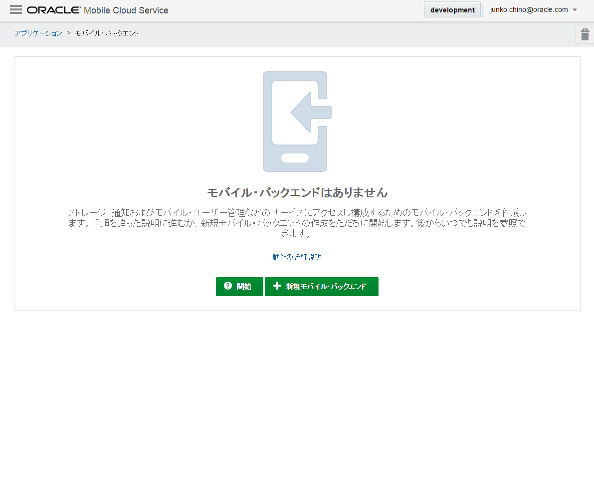

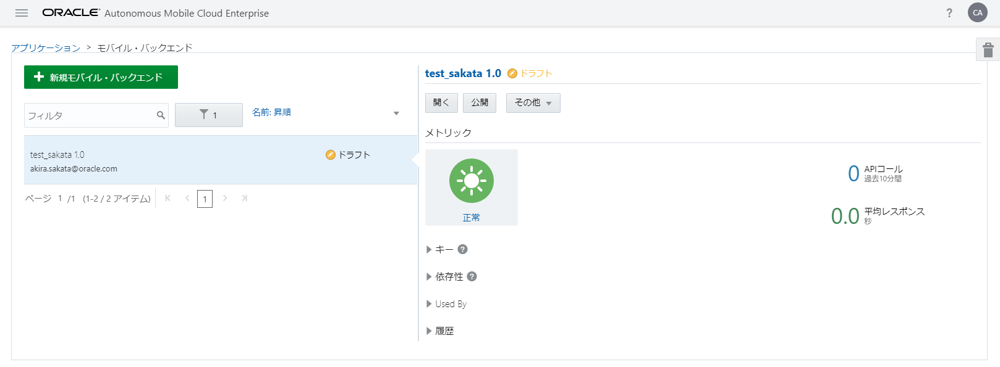

**Step-5** 「新規モバイル・バックエンド」ダイアログ・ボックスがポップアップします。表 2 1のようにモバイル・バックエンドの名前と説明を入力して「作成」ボタンをクリックします。

表 2 1: 「新規モバイル・バックエンド」ダイアログ・ボックスに入力する値
入力項目	説明
名前	FIF_Technician_<xx>
（<xx>はMCSインスタンス内で一意となる文字列）
説明	（モバイル・バックエンドを説明する任意の文字列）

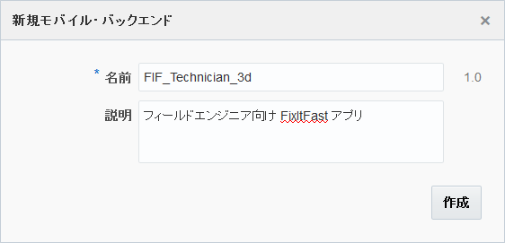

**Step-6** モバイル・バックエンドが作成されると、作成されたモバイル・バックエンドの「設定」ページが表示されます。このページではモバイル・アプリケーションで用いる認証方式など、MCS上のリソースにアクセスするために必要な情報の設定および確認が可能です。

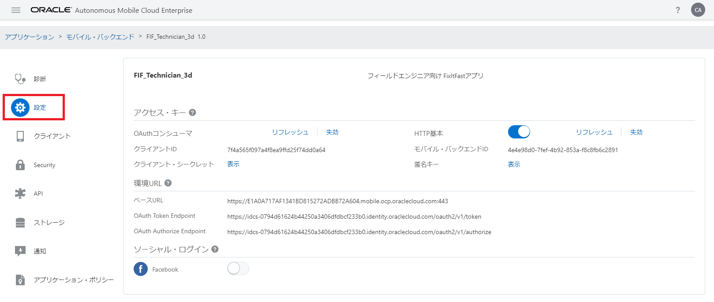

**Step-7** モバイル・バックエンドの「診断」ページでは、モバイル・バックエンドに関連付けられたモバイル・アプリからのリクエスト状況の確認やログを参照できます。

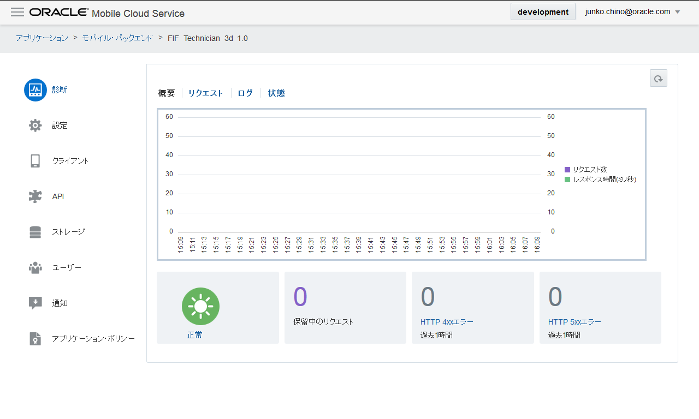

**Step-8** モバイル・バックエンドの「クライアント」ページでは、モバイル・バックエンドを介してMCS上のリソースにアクセスするモバイル・アプリを登録できます。

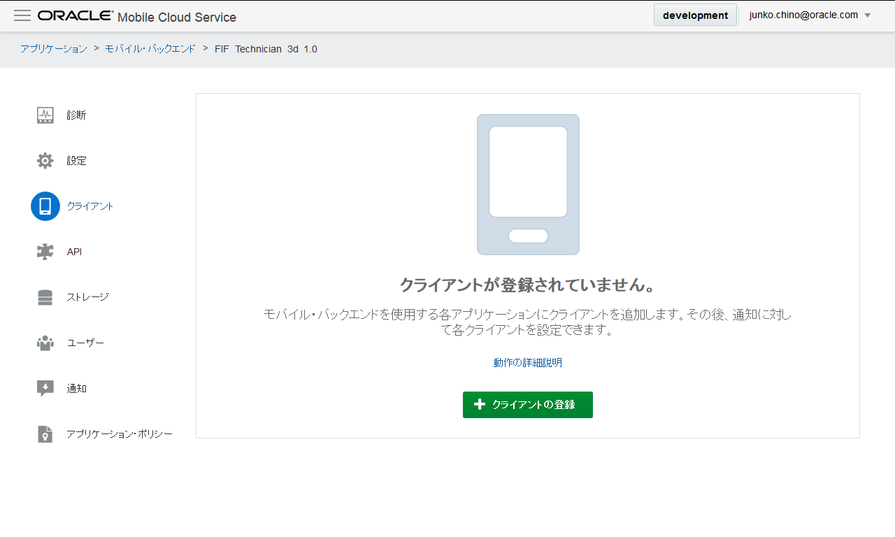

モバイル・アプリに対してプッシュ通知を送信する場合は、プラットフォームごとに必要な証明書などの情報を登録します。プッシュ通知を送信しない場合は、モバイル・アプリの登録は必須ではありません。登録することによってアプリを識別するためのキーが発行されるので、アプリごとにアクセス状況を監視または分析できます。

**Step-9** モバイル・バックエンドの「API」ページでは、モバイル・アプリに対して公開するカスタムAPIを選択します。詳細は『2.3 モバイル・バックエンドとカスタムAPIの関連づけ』（24ページ）で説明します。

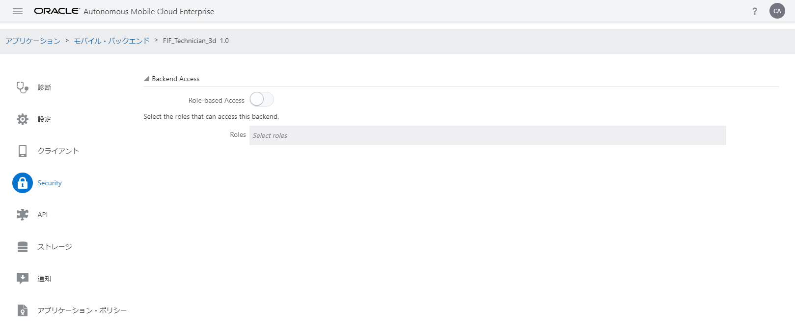

**Step-10** モバイル・バックエンドの「ストレージ」ページは、MCSのプラットフォームAPIの１つ、Storage APIを使用してアプリケーション・データをサーバー・サイドに永続化するための構成情報を選択できます。詳細は、『3 ストレージ・サービスを使用したデータの永続化』（32ページ）で説明します。

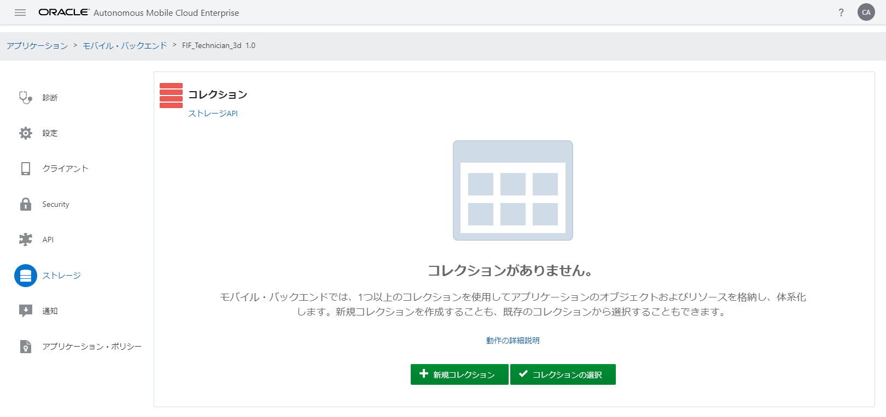
図 2 11: モバイル・バックエンドの「ストレージ」ページ

**Step-11** MCSはモバイル・バックエンドでグループ化されたリソースへのアクセスを許可するユーザーのグループを「レルム」と呼びます。モバイル・バックエンドの「ユーザー」ページは、モバイル・バックエンドに関連づけられているレルムに属するユーザーの一覧を表示します。必要に応じてユーザー情報の編集やユーザーの削除、パスワードのリセットなども可能です。

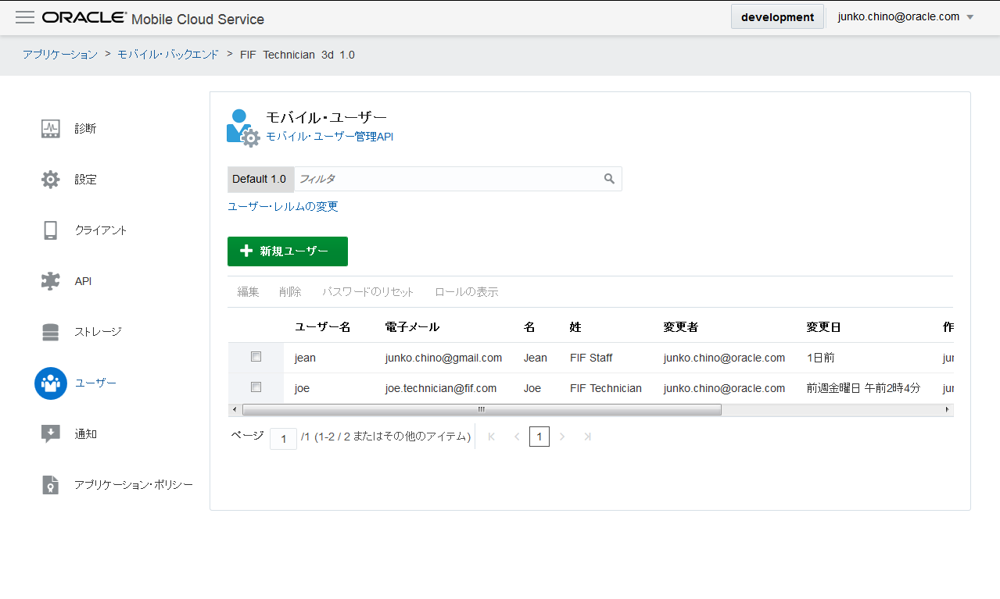
図 2 12: モバイル・バックエンドの「ユーザー」ページ

**Step-12** モバイル・バックエンドの「通知」ページを使用すると、「クライアント」ページで登録したモバイル・アプリに対してプッシュ通知を送信することができます。モバイル・アプリに対してプッシュ通知を送信する場合は、iOSやAndroid、Windowsでそれぞれ手続きが異なります。MCSを使用する場合は、ユーザーがどのプラットフォームを使用しているかを意識する必要がありません。「クライアント」ページからモバイル・アプリを適切に登録されていれば、一度に複数のプラットフォームの端末に対してプッシュ通知を送信できます。

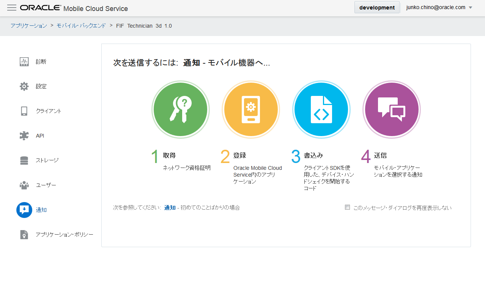
図 2 13: モバイル・バックエンドの「通知」ページ

**Step-13** モバイル・バックエンドの「アプリケーション・ポリシー」ページでは、モバイル・アプリが共通で使用するカスタム・プロパティを定義し、値を制御することができます。アプリケーション・ポリシーの値は、プラットフォームAPIによって簡単にアクセスし取得することができます。

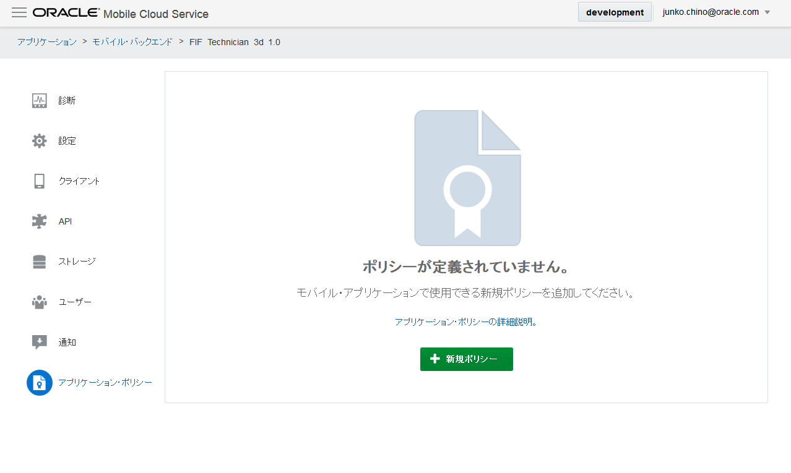

