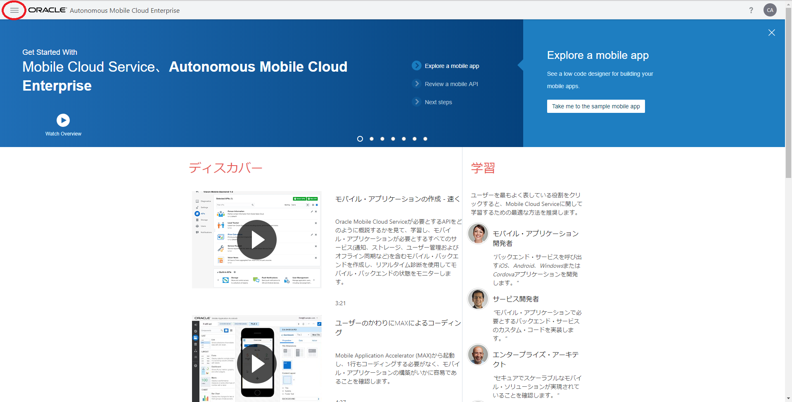
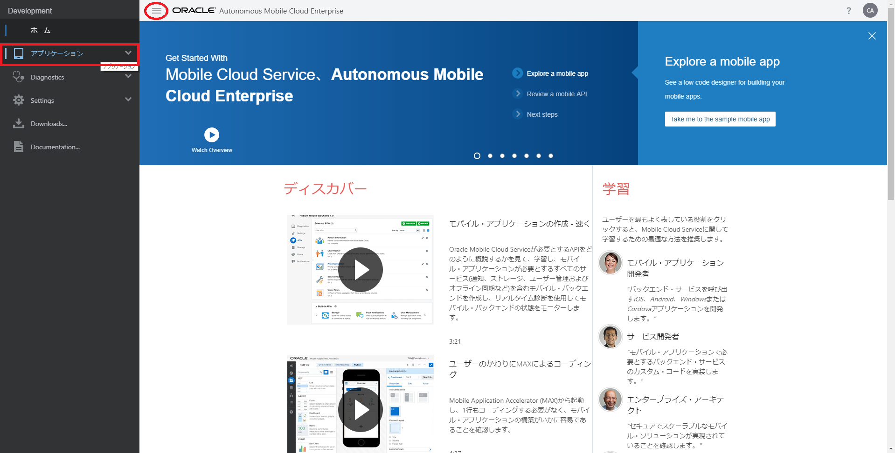
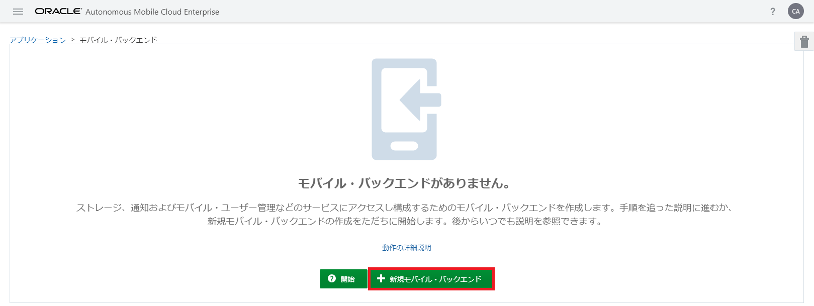
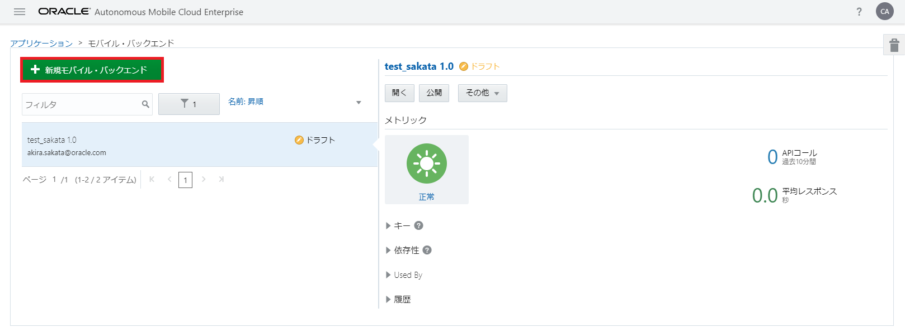
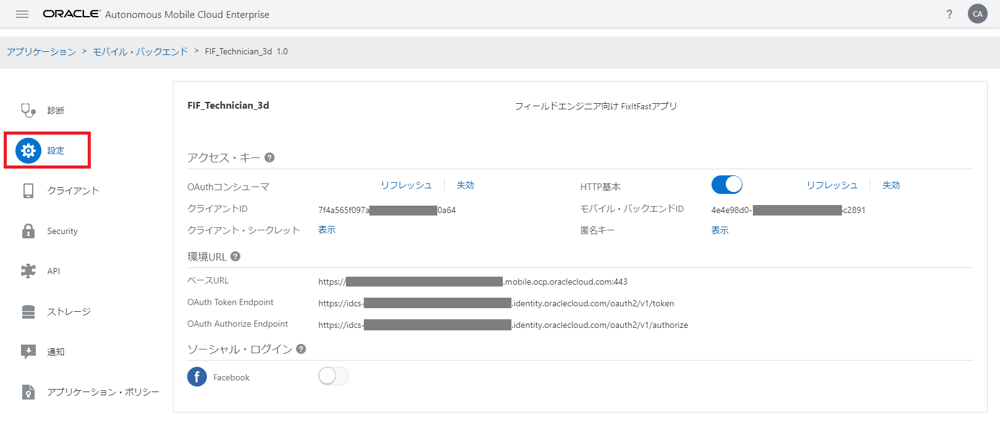
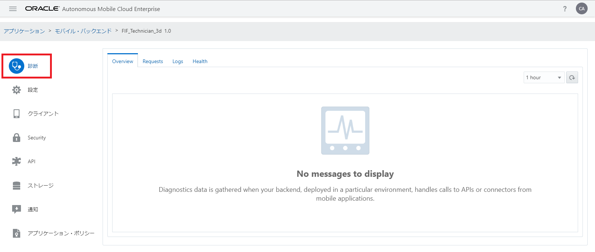
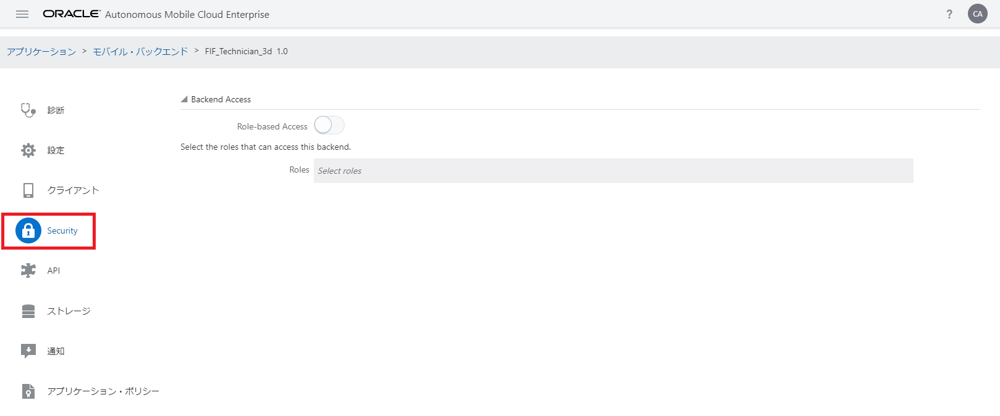
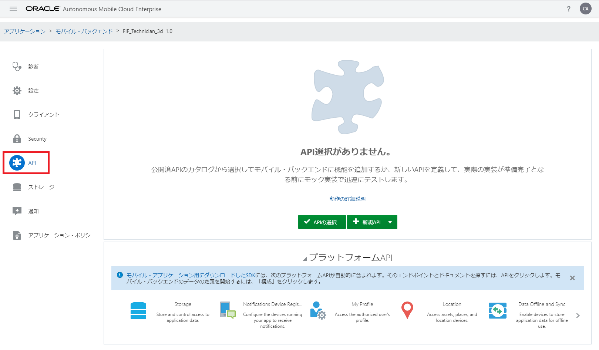
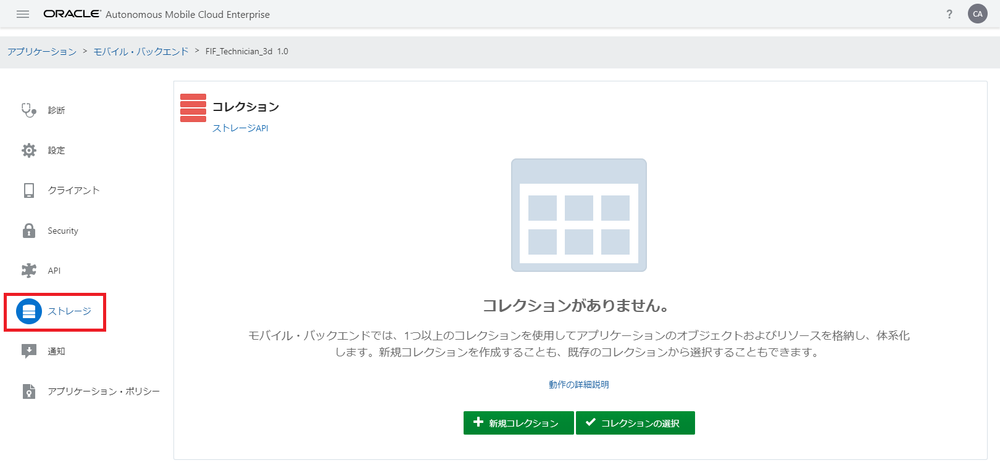
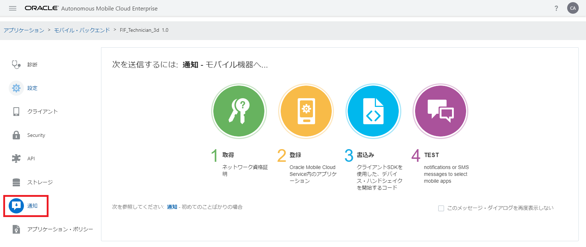

## モバイル・バックエンドの作成

ここでは、モバイル・バックエンドを作成します。また、AMCeのサービス・コンソールが提供しているモバイル・バックエンドの構成のための機能について一通り説明します。

**Step-1** AMCeのサービス・コンソールにログインします。「ホーム」ページが表示されたら、画面左上にあるハンバーガー・アイコンをクリックします。

 

<strong>図：画面左上のハンバーガー・アイコンをクリック</strong>

**Step-2** 画面の左側にメニュー・パネルが表示されます。「アプリケーション」をクリックして、「アプリケーション」ページを開きます。

 
<strong>図：画面左のメニューから「アプリケーション」をクリック</strong>

メニューの右横にあるハンバーガー・アイコンをクリックすると、メニューを閉じることができます。

**Step-3** 「アプリケーション」ページにある「モバイル・バックエンド」をクリックします。

 
<strong>図：「アプリケーション」ページで「モバイル・バックエンド」をクリック</strong>

**Step-4** 「モバイル・バックエンド」ページが表示されます。「新規モバイル・バックエンド」ボタンをクリックします。

 
<strong>図：【モバイル・バックエンドがまだ一つも作成されていない場合】「モバイル・バックエンド」ページ</strong>

 
<strong>図：【モバイル・バックエンドがすでに作成されている場合】「モバイル・バックエンド」ページ</strong>

**Step-5** 「新規モバイル・バックエンド」ダイアログ・ボックスがポップアップします。下記の表のようにモバイル・バックエンドの名前と説明を入力して「作成」ボタンをクリックします。

**表：「新規モバイル・バックエンド」ダイアログ・ボックスに入力する値**

| 入力項目 | 説明                                                         |
| :------- | :----------------------------------------------------------- |
| 名前     | FIF_Technician_xx （xxはAMCeインスタンス内で一意となる文字列） |
| 説明     | （モバイル・バックエンドを説明する任意の文字列）             |

 
<strong>図：「新規モバイル・バックエンド」ダイアログ・ボックス</strong>

**Step-6** モバイル・バックエンドが作成されると、作成されたモバイル・バックエンドの「設定」ページが表示されます。このページではモバイル・アプリケーションで用いる認証方式など、AMCe上のリソースにアクセスするために必要な情報の設定および確認が可能です。

 
<strong>図：モバイル・バックエンドの「設定」ページ</strong>

**Step-7** モバイル・バックエンドの「診断」ページでは、モバイル・バックエンドに関連付けられたモバイル・アプリからのリクエスト状況の確認やログを参照できます。

 
<strong>図：モバイル・バックエンドの「診断」ページ</strong>

**Step-8** モバイル・バックエンドの「クライアント」ページでは、モバイル・バックエンドを介してAMCe上のリソースにアクセスするモバイル・アプリを登録できます。

 
<strong>図：モバイル・バックエンドの「クライアント」ページ</strong>

モバイル・アプリに対してプッシュ通知を送信する場合は、プラットフォームごとに必要な証明書などの情報を登録します。プッシュ通知を送信しない場合は、モバイル・アプリの登録は必須ではありません。登録することによってアプリを識別するためのキーが発行されるので、アプリごとにアクセス状況を監視または分析できます。

**Step-9** モバイル・バックエンドの「Security」ページでは、Role-based Accessを可能にし、ユーザー・ロールを指定することで、バックエンド（さらに、それが表すリソース）にセキュリティの追加レイヤーを提供します。

 
<strong>図：モバイル・バックエンドの「Security」ページ</strong>

**Step-10** モバイル・バックエンドの「API」ページでは、モバイル・アプリに対して公開するカスタムAPIを選択します。詳細は『[モバイル・バックエンドとカスタムAPIの関連づけ](2.backend-3.md)』で説明します。

 
<strong>図：モバイル・バックエンドの「API」ページ</strong>

**Step-11** モバイル・バックエンドの「ストレージ」ページは、AMCeのプラットフォームAPIの１つ、Storage APIを使用してアプリケーション・データをサーバー・サイドに永続化するための構成情報を選択できます。

 
<strong>図：モバイル・バックエンドの「ストレージ」ページ</strong>

**Step-12** モバイル・バックエンドの「通知」ページを使用すると、「クライアント」ページで登録したモバイル・アプリに対してプッシュ通知を送信することができます。モバイル・アプリに対してプッシュ通知を送信する場合は、iOSやAndroid、Windowsでそれぞれ手続きが異なります。AMCeを使用する場合は、ユーザーがどのプラットフォームを使用しているかを意識する必要がありません。「クライアント」ページからモバイル・アプリを適切に登録されていれば、一度に複数のプラットフォームの端末に対してプッシュ通知を送信できます。

 
<strong>図：モバイル・バックエンドの「通知」ページ</strong>

**Step-13** モバイル・バックエンドの「アプリケーション・ポリシー」ページでは、モバイル・アプリが共通で使用するカスタム・プロパティを定義し、値を制御することができます。アプリケーション・ポリシーの値は、プラットフォームAPIによって簡単にアクセスし取得することができます。

 
<strong>図：モバイル・バックエンドの「アプリケーション・ポリシー」ページ</strong>

