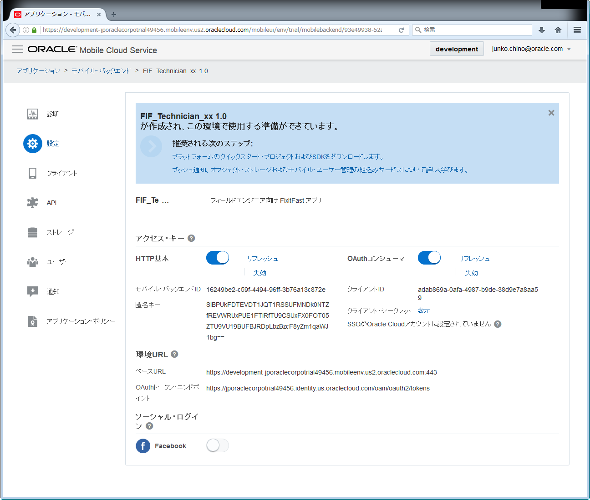
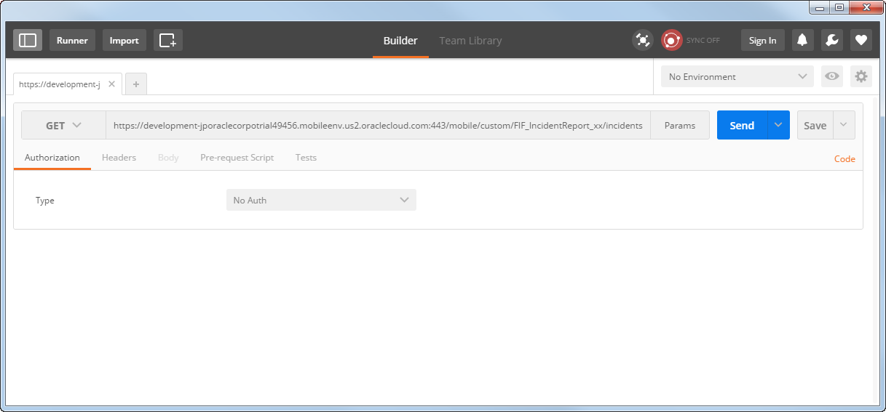
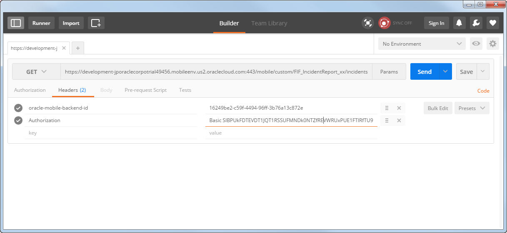
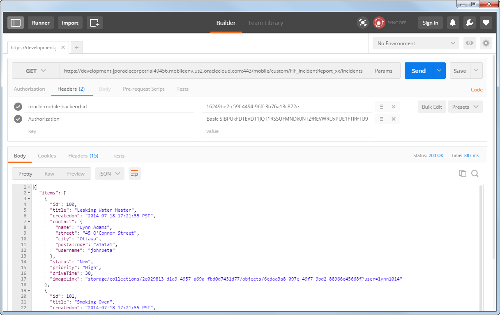

## カスタムAPIのコール

この章の『[RAMLドキュメントを使用したAPIの定義とテスト](2.backend-2.md)』では、APIデザイナが提供するテスト・ツールを使用して登録したAPIをテストしました。ここでは、Postmanを使用して、AMCeの外部からAPIをコールする手順を確認します。Postmanは、Google Chromeのアドオン・アプリケーションの１つで、HTTPヘッダーやリクエスト・パラメータなどをGUIで指定することができ、REST APIのテスト実行が簡単に行えます。

**Step-1** モバイル・バックエンド「FIF_Technician_xx（このハンズオンの『[モバイル・バックエンドの作成](2.backend-1.md)』で作成したモバイル・バックエンド）の「設定」ページを開き、次の値を確認します。

- モバイル・バックエンドID
- 匿名キー（「表示」リンクをクリックして表示させる）
- ベースURL

>**備考：**Webブラウザの画面サイズによっては以下の図とはレイアウト異なることがあります。

 
<strong>図：モバイル・バックエンドの「設定」ページ</strong>

**Step-2** デスクトップにあるPostmanのアイコンをダブルクリックし、Postmanを起動します。「Enter request URL」とヒントが表示されている入力フィールドに、『[RAMLドキュメントを使用したAPIの定義とテスト](2.backend-2.md)』で登録したカスタムAPIのFIF_IncidentReport_xxのGET /incidentsリソースのURLを入力します。

*<ベースURL>*/mobile/custom/FIF_IncidentReport_xx/incidents

 
<strong>図：PostmanでカスタムURLのリソースURLを指定</strong>

**Step-3** 「Headers」タブ・ページを開き、下記の表のように「key」と「value」を指定します。

**表：「Headers」タブ・ページに指定する「key」と「value」**

| key | value                                                         |
| :------- | :----------------------------------------------------------- |
| oracle-mobile-backend-id     | *<モバイル・バックエンドID>* |
| Authorization     | Basic *<匿名キー>* |

 
<strong>図：Postmanの「Headers」タブ・ページに「key」と「value」を指定</strong>

**Step-4** 「Send」ボタンをクリックすると、レスポンスが表示されます。

 
<strong>図：Postmanにレスポンスが表示された状態</strong>

悪意のあるモバイル・アプリからリソースを保護するため、AMCe上にホストされたAPIを実行する場合、たとえ認証が不要だったとしても、モバイル・バックエンドIDと匿名キーをヘッダー情報に指定してリクエストを送信する必要があります。
