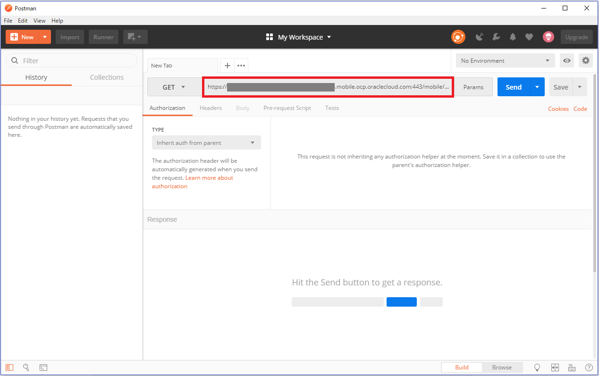
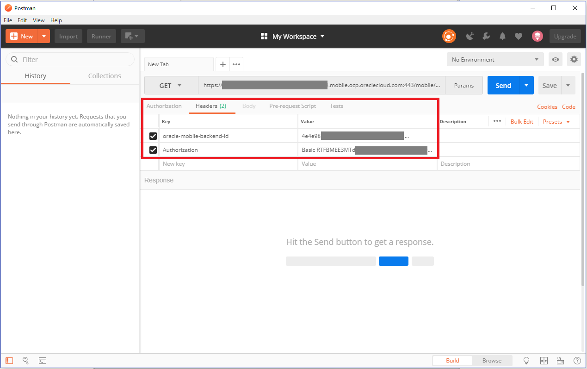

## カスタムAPIのコール

この章の『[RAMLドキュメントを使用したAPIの定義とテスト](2.backend-2.md)』では、APIデザイナが提供するテスト・ツールを使用して登録したAPIをテストしました。ここでは、Postmanを使用して、AMCeの外部からAPIをコールする手順を確認します。Postmanは、Google Chromeのアドオン・アプリケーションの１つで、HTTPヘッダーやリクエスト・パラメータなどをGUIで指定することができ、REST APIのテスト実行が簡単に行えます。

**Step-1** モバイル・バックエンド「FIF_Technician_<xx>（このハンズオンの『[モバイル・バックエンドの作成](2.backend-1.md)』で作成したモバイル・バックエンド）の「設定」ページを開き、次の値を確認します。

- モバイル・バックエンドID
- 匿名キー（「表示」リンクをクリックして表示させる）
- ベースURL

>**備考：**Webブラウザの画面サイズによっては図 2 36とはレイアウト異なることがあります。

**Step-2** デスクトップにあるPostmanのアイコンをダブルクリックし、Postmanを起動します。「Enter request URL」とヒントが表示されている入力フィールドに、『[RAMLドキュメントを使用したAPIの定義とテスト](2.backend-2.md)』で登録したカスタムAPIのFIF_IncidentReport_<xx>のGET /incidentsリソースのURLを入力します。

<ベースURL＞/mobile/custom/FIF_IncidentReport_<xx>/incidents

**Step-3** 「Headers」タブ・ページを開き、下記の表のように「key」と「value」を指定します。
**「Headers」タブ・ページに指定する「key」と「value」**

| key | value                                                         |
| :------- | :----------------------------------------------------------- |
| oracle-mobile-backend-id     | <モバイル・バックエンドID> |
| Authorization     | Basic <匿名キー> |

**Step-4** 「Send」ボタンをクリックすると、レスポンスが表示されます。

悪意のあるモバイル・アプリからリソースを保護するため、AMCe上にホストされたAPIを実行する場合、たとえ認証が不要だったとしても、モバイル・バックエンドIDと匿名キーをヘッダー情報に指定してリクエストを送信する必要があります。
