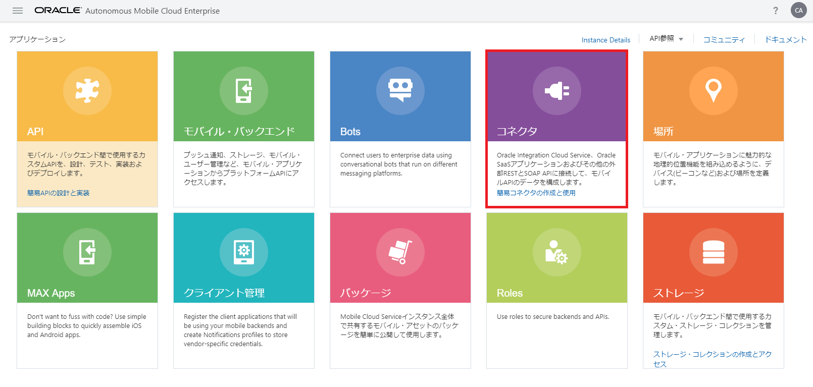
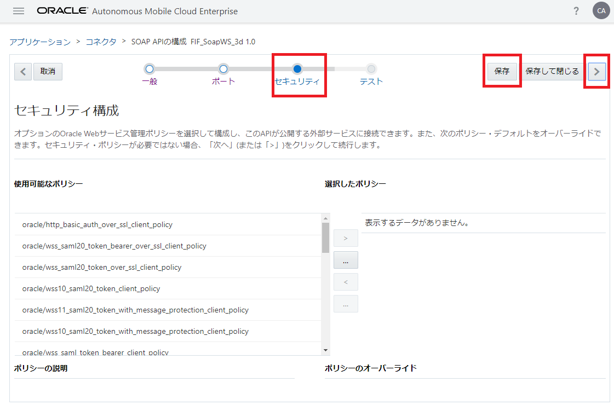
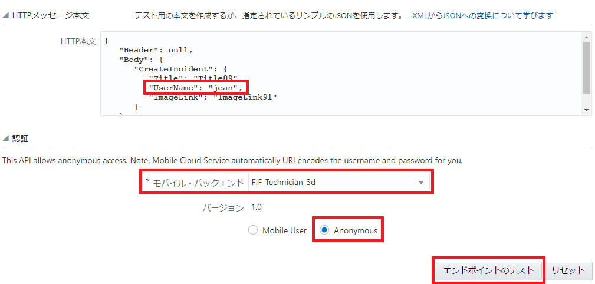
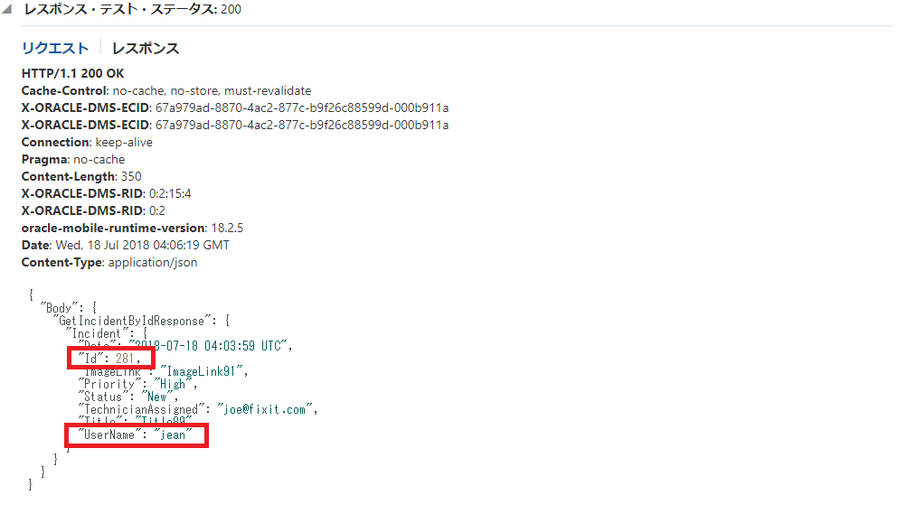

## SOAP Webサービスに対するコネクタの定義とテスト

ここでは、SOAP Webサービスにアクセスするためのコネクタを定義し、テストします。

**Step-1** サービス・コンソールにログインし、ハンバーガー・アイコンをクリックします。画面左にメニューが表示されたら、「アプリケーション」を選択します。

**Step-2** 「アプリケーション」ページの「コネクタ」をクリックします。

**Step-3** 「コネクタ」ページが表示されたら、「SOAP」をクリックします。

**Step-4** 「新規SOAPコネクタAPI」ダイアログ・ボックスがポップアップします。表 4 1のように入力します。

表 4 1: 「新規SOAPコネクタAPI」ダイアログ・ボックスに入力する値

| 入力項目 | 入力する値                                                         |
| :------- | :----------------------------------------------------------- |
| API表示名     | FIF_SoapWS_<xx> （<xx>はAMCeインスタンス内で一意となる文字列） |
| API名     | FIF_SoapWS_<xx> （「API表示名」と同じ値を指定） |
| WSDL URL     | http://129.150.114.58:7001/McsBetaSoapApp-MockRightNowService-context-root/IncidentServicePort?WSDL |
| 簡単な説明     | （コネクタについて説明する任意の文）             |

**Step-5** 「SOAP APIの構成」ウィザードの「一般」ページが表示されます。「保存」ボタンをクリックしてから、「> （次のステップ）」ボタンをクリックします。

**Step-6** 「SOAP APIの構成」ウィザードの「ポート」ページが表示されます。ここでは、モバイル・アプリ向けに公開するSOAP Webサービスのオペレーションの名前を変更できます。
今回は初期状態のままで「保存」ボタンをクリックしてから、「> （次のステップ）」ボタンをクリックします。

**Step-7** 「SOAP APIの構成」ウィザードの「セキュリティ」ページが表示されます。選択したSOAP WebサービスがWS-Securityで保護されている場合は、ここでセキュリティ・ポリシーを選択できます。

今回は初期状態のままで「保存」ボタンをクリックしてから、「> （次のステップ）」ボタンをクリックします。

**Step-8** 「SOAP APIの構成」ウィザードの「テスト」ページが表示されます。

**Step-9** 最初にエンドポイント「CreateIncident」をテスト実行します。このエンドポイントは、新たにインシデントの情報を作成する際に使用します。「POST CreateIncident」をクリックし、パネルを開きます。

「HTTP本文」の中の「UserName」の値を適当なユーザー名に置き換えます（この図では「jean」と指定）。「認証」ブロックの「モバイル・バックエンド」は「FIF_Technician_<xx>」を、ユーザーは「Anonymous」を選択し、「エンドポイントのテスト」ボタンをクリックします。

**Step-10** SOAP Webサービスの呼び出しが成功すると、レスポンスのHTTPステータス・コードとして200が返ってきます。

次に実行するテストのために、「IncidentId」の値を確認します。

**Step-11** 次にエンドポイント「GetIncidentById」をテストします。「Post GetIncidentById」をクリックしてパネルを開き、「HTTP本文」内の「IncidentId」の値を**Step-10**で取得したレスポンスに記述されていた「IncidentId」の値と置き換えます。

「認証」ブロックの「モバイル・バックエンド」は「FIF_Technician_<xx>」を、ユーザーは「Anonymous」を選択し、「エンドポイントのテスト」ボタンをクリックします。

**Step-12** レスポンスのHTTPステータス・コードとして200が返ってきたら、レスポンスの「Id」がリクエストの「HTTP本文」内で指定した「IncidentId」の値と、「UserName」の値が手順9のエンドポイント「CreateIncident」のテストにおいて指定した「UserName」と一致することを確認します。

**Step-13** 最後に、「GetIncidentsByTechnician」というオペレーションをテストします。「POST GetIncidentsByTechnician」をクリックしてパネルを開き、「HTTP本文」内の「TechnicianEmailAddress」の値を「joe@fixit.com」と置き換えます。

「認証」ブロックの「モバイル・バックエンド」は「FIF_Technician_<xx>」を、ユーザーは「Anonymous」を選択し、「エンドポイントのテスト」ボタンをクリックします。

**Step-14** レスポンスのHTTPステータス・コードとして200が返ってきたら、配列「Incident」の各要素の「TechnicianAssigned」の値が「joe@fixit.com」であることを確認します。

**Step-15** テストが終わったら画面右上の「完了」ボタンをクリックします。

