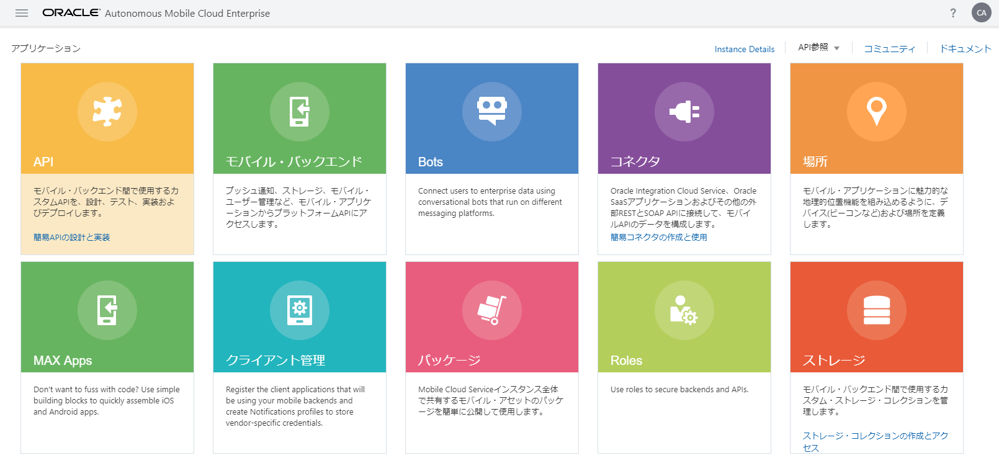
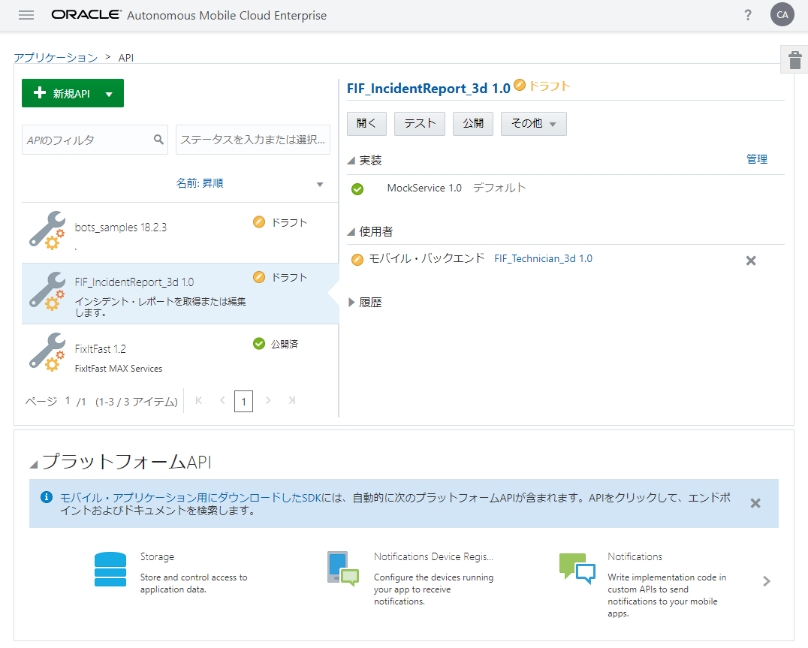
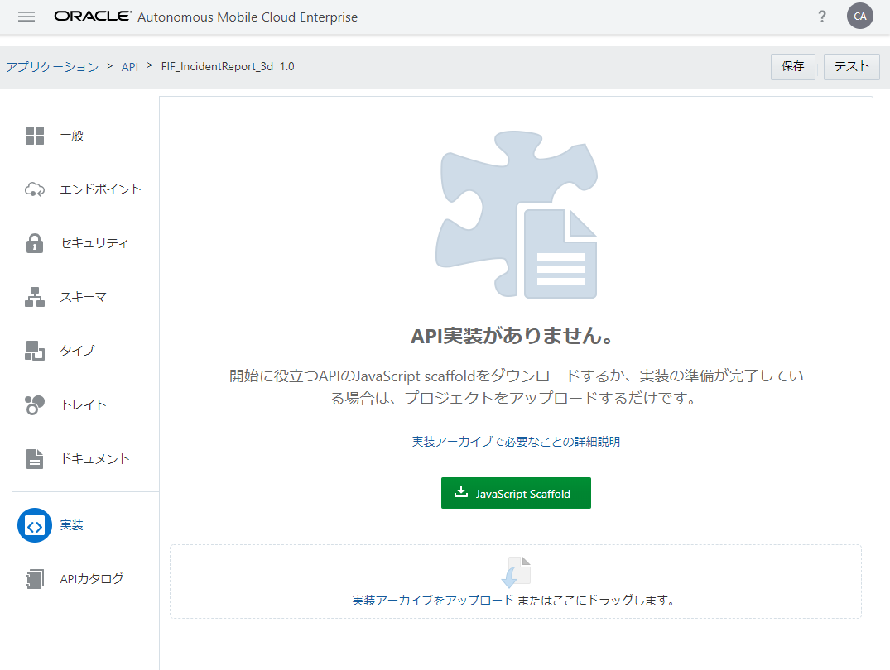

## JavaScript Scaffoldのダウンロード

AMCeにカスタムAPIを登録すると、カスタムAPIの実装の開始ポイントとなるJavaScript Scaffoldがダウンロードできるようになります。ここでは、JavaScript Scaffoldをダウンロードして、中身を確認してみます。

**Step-1** サービス・コンソールにログインし、ハンバーガー・アイコンをクリックします。画面左にメニューが表示されたら、「アプリケーション」を選択します。

**Step-2** 「アプリケーション」ページの「API」をクリックします。

**Step-3** 「API」ページが表示されます。画面左のリストから『[モバイル・バックエンドの作成とテスト － RAMLドキュメントを使用したAPIの定義とテスト](2.backend-2.md)』で作成したカスタムAPI「FIF_IncidentReport_<xx>」を選択し、「開く」ボタンをクリックします。

**Step-4** 「FIF_IncidentReport_<xx>」のAPIデザイナが表示されます。APIデザイナの「実装」ページを開き、「JavaScript Scaffold」ボタンをクリックします。

**Step-5** ZIPファイルfif_incidentreport_<xx>_1.0.zipがダウンロードされます。任意のディレクトリで解凍すると、fif_incidentreport_<xx>フォルダが作成され、表 5 1の４つのファイルが含まれています。

表 5 1: fif_incidentreport_<xx>_1.0.zipに含まれるファイル

| ファイル名 | 説明                                                         |
| :------- | :----------------------------------------------------------- |
| fif_incidentreport_<xx>.js     | カスタムAPIの設計情報に基づいたスタブ実装を含むスケルトン・コード |
| package.json     | Node.jsで用いられる、パッケージの依存関係を記述したJSONファイル             |
| ReadMe.md     | ZIPファイル内に含まれているソース・ファイルの説明が記述されたファイル             |
| sample.txt     | カスタムAPIの実装時によく使用されるコード・スニペット             |
| fif_incidentreport_<xx>.raml     | API定義情報を保存しているRAMLドキュメント             |
| swagger.json     | カスタムAPIのSwagger定義ファイル             |
| toolsConfig.json     | AMCeコマンドライン開発ツールで使用されるファイル             |

**Step-6** fif_incidentreport_<xx>.jsを任意のテキスト・エディタで開きます。AMCeのAPIデザイナで定義されているエンドポイントに対応したスタブが記述されていることを確認します。

表 5 2: エンドポイントとそのスタブ

| エンドポイント | fif_incidentreport_<xx>.js                                                         |
| :------- | :----------------------------------------------------------- |
| GET/incidents/{id}     | 20～39行目            |
| GET /incidents/{id}/status     | 41～54行目           |
| POST /incidents     | 56～68行目 |
| GET /incidents     | 70～118行目          |