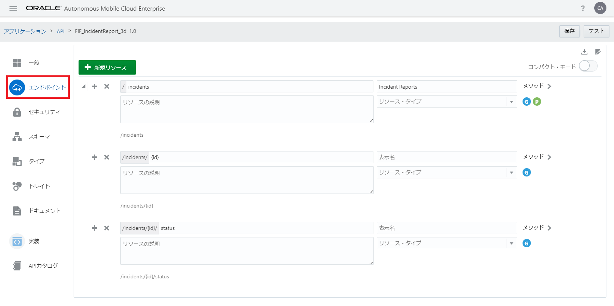
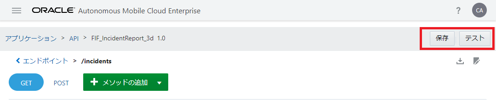
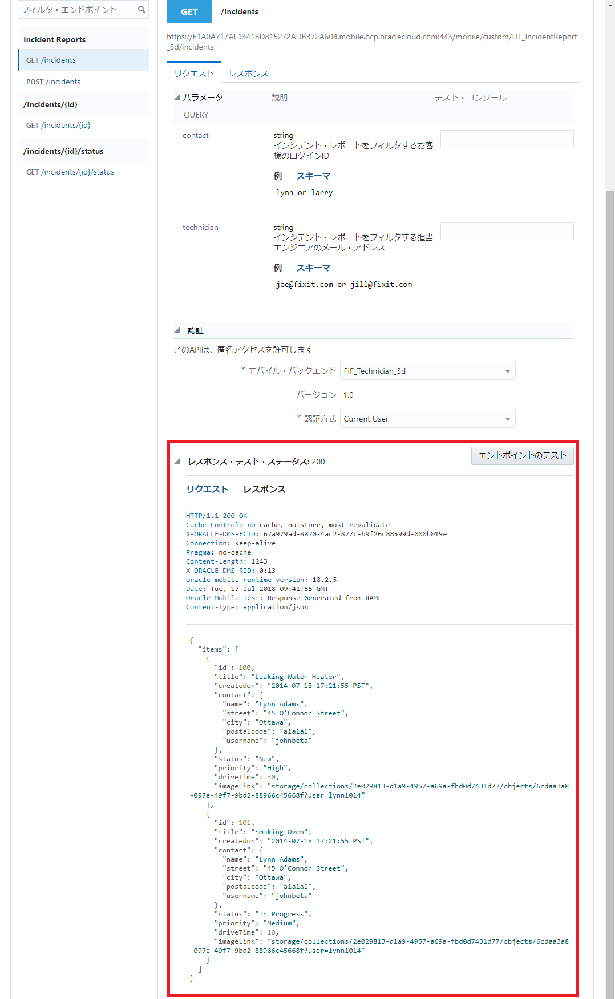

## RAMLドキュメントを使用したAPIの定義とテスト

ここでは、モバイル・アプリから呼び出すことのできるカスタムAPIの設計情報を登録します。AMCeでは、APIの設計情報をRAML（RESTful API Modeling Language）で記述します。APIの設計は、AMCeのサービス・コンソールが提供するAPIデザイナを使用して、一から定義することも可能ですが、今回は事前に作成されたRAMLドキュメントを使用します。

**Step-1** サービス・コンソールの左上にあるハンバーガー・アイコンをクリックして画面左のメニューを開き、「アプリケーション」をクリックします。

 
<strong>図：画面左のメニューから「アプリケーション」をクリック</strong>

**Step-2** 「アプリケーション」ページで「API」をクリックします。。

 
<strong>図：「アプリケーション」ページで「API」をクリック</strong>

**Step-3** 「API」ページが表示されます。「新規API」ボタンをクリックします。

 
<strong>図：【カスタムAPIがまだ一つも定義されていない場合】「API」ページで「新規API」ボタンをクリック</strong>

 
<strong>図：【カスタムAPIがすでに定義されている場合】「API」ページで「新規API」ボタンをクリック</strong>

**Step-4** 「新規API」ダイアログ・ボックスがポップアップします。「RAMLドキュメントをアップロード」というリンクをクリックします。

 
<strong>図：「新規API」ダイアログ・ボックスの「RAMLドキュメントをアップロード」をクリック</strong>

**Step-5** アップロードするファイルを選択するウィンドウが表示されるので、C:\HOL\AMCeディレクトリのFIF_IncidentReport.ramlを選択します。「新規API」ダイアログ・ボックスに「FIF_IncidentReport.raml: アップロードおよび検証されました」というメッセージが表示されることを確認します。

 
<strong>図：FIF_IncidentReport.ramlをアップロードした直後の「新規API」ダイアログ・ボックス</strong>

**Step-6** 「新規API」ダイアログ・ボックスの「API表示名」と「API名」には、それぞれ初期値が設定されているので、下記の表のように変更します。

**表：「新規API」ダイアログ・ボックスの値を編集**

| 入力項目 | 入力する値                                                         |
| :------- | :----------------------------------------------------------- |
| API表示名     | FIF_IncidentReport_xx （xxはAMCeインスタンス内で一意となる文字列） |
| API名     | FIF_IncidentReport_xx （「API表示名」と同じ値を指定） |
| 簡単な説明     | （APIを説明する任意の文）             |

 
<strong>図：「新規API」ダイアログ・ボックスで「API表示名」、「API名」、「簡単な説明」を編集</strong>

編集が終わったら、「作成」ボタンをクリックします。

**Step-7** APIが作成されると、APIデザイナの「一般」ページが表示されます。

 
<strong>図：APIデザイナの「一般」ページ</strong>

**Step-8** APIデザイナの「セキュリティ」ページを開きます。認証されていないユーザーからのリクエストを許可するために、「ログインが必要です」のスイッチをオフにします。

 
<strong>図：APIデザイナの「セキュリティ」ページで「ログインが必要です」スイッチをオフ</strong>

**Step-9** アップロードしたRAMLドキュメントの定義内容を確認するために、APIデザイナの「エンドポイント」タブ・ページを開きます。RAMLドキュメントに定義されたリソースが一覧できます。

 
<strong>図：APIデザイナの「エンドポイント」ページ</strong>

**Step-10** 「/inicidents」リソースの右側には、２つのアイコン ― 青色の「G（GETメソッド）」と緑色の「P（POSTメソッド）」が表示されています。これら２つのアイコンは、「/incidents」リソースがGETリクエストとPOSTリクエストに対応していることを表しています。「G（GETメソッド）」アイコンをクリックします。

 
<strong>図：APIデザイナの「エンドポイント」ページ － 「Incidents」リソース</strong>

**Step-11** 「/incidents」リソースにGETリクエストを送信するために指定可能なパラメータを確認できます。「contact」、「technician」の２つのクエリー・パラメータを指定できることがわかります。

 
<strong>図：「/incidents」リソースのGETリクエストに指定するパラメータ</strong>

**Step-12** 「レスポンス」リンクをクリックすると、HTTPステータス・コードごとにどのようなレスポンスが返ってくるかを確認できます。「/incidents」リソースのGETリクエストの場合、ステータス200が返ってきた場合は、「例」タブ・ページに記述されているようなJSONが返ってくることを表しています。

 
<strong>図：「/incidents」リソースのGETリクエストのレスポンスの例</strong>

**Step-13** 登録したカスタムAPIをテストしてみます。APIデザイナの画面右上の「保存」ボタンをクリックして保存してから、「テスト」ボタンをクリックします。

 
<strong>図：APIデザイナの「保存」ボタンと「テスト」ボタンをクリック</strong>

**Step-14** 「画面左のリストで「GET /incidents」を選択します。画面を下にスクロールし、「認証」パネルで「モバイル・バックエンド」から「FIF_Technician_xx」（このハンズオンの『[モバイル・バックエンドの作成](2.backend-1.md)』で作成したモバイル・バックエンド）を選択し、「認証方式」から「Current User」を選択し、「エンドポイントのテスト」ボタンをクリックします。

 
<strong>図：APIのエンドポイントのテスト</strong>

このAPIはまだ実装されていませんが、AMCeはAPIが実装されるまでの間、モック・データを返すことができます。モック・データはRAMLドキュメントに記述されたレスポンスの本文の例に基づいて生成されます。

 
<strong>図：APIのエンドポイントのテスト － レスポンスのモック・データの表示</strong>

