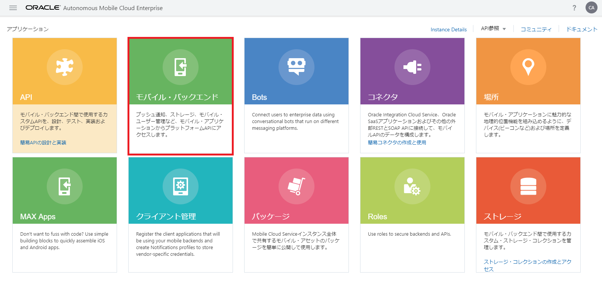

## モバイル・バックエンドとカスタムAPIの関連づけ

実際にモバイル・アプリからAMCe上で実行されているカスタムAPIをコールするためには、モバイル・バックエンドとカスタムAPIを関連づける必要があります。手順は次のとおりです。

**Step-1** サービス・コンソールにログインし、ハンバーガー・アイコンをクリックして画面左のメニューから「アプリケーション」を選択します。「アプリケーション」ページが表示されたら、「モバイル・バックエンド」をクリックします。

<strong>図：「アプリケーション」ページで「モバイル・バックエンド」をクリック</strong>

**Step-2** 画面左のリストから、「FIF_Technician_<xx>（このハンズオンの『[モバイル・バックエンドの作成](2.backend-1.md)』で作成したモバイル・バックエンド）を選択し、「開く」ボタンをクリックします。

>**備考：**モバイル・バックエンドの名前につけた「<xx>」の文字列で検索すると、リストされるモバイル・バックエンドがフィルタリングされて便利です。

<strong>図：モバイル・バックエンドを選択して「開く」ボタンをクリック</strong>

**Step-3** モバイル・バックエンドの「API」ページを開き、「APIの選択」ボタンをクリックします。

<strong>図：モバイル・バックエンドの「API」ページで「APIの選択」ボタンをクリック</strong>

**Step-4** 「APIカタログ」が表示されます。「FIF_IncidentReport_<xx>」（このハンズオンの『[RAMLドキュメントを使用したAPIの定義とテスト](2.backend-2.md)』で登録したカスタムAPI）のボックスの右下に表示されている「＋（APIの選択）」ボタンをクリックします。

<strong>図：APIカタログで「FIF_IncidentRepor_<xx>」を選択</strong>

**Step-5** 画面右側の「選択済みAPI」に「FIF_IncidentRepor_<xx>」が表示されます。

<strong>図：APIカタログでAPIを選択した状態</strong>

画面左上のリンク「< FIF_Technician_<xx> 1.0」をクリックします。

