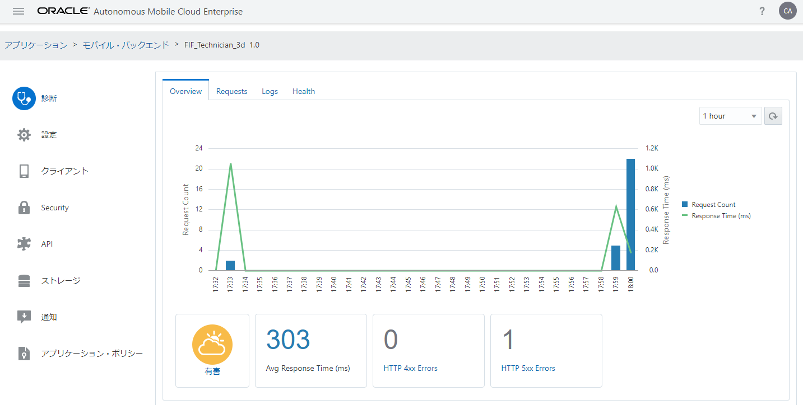
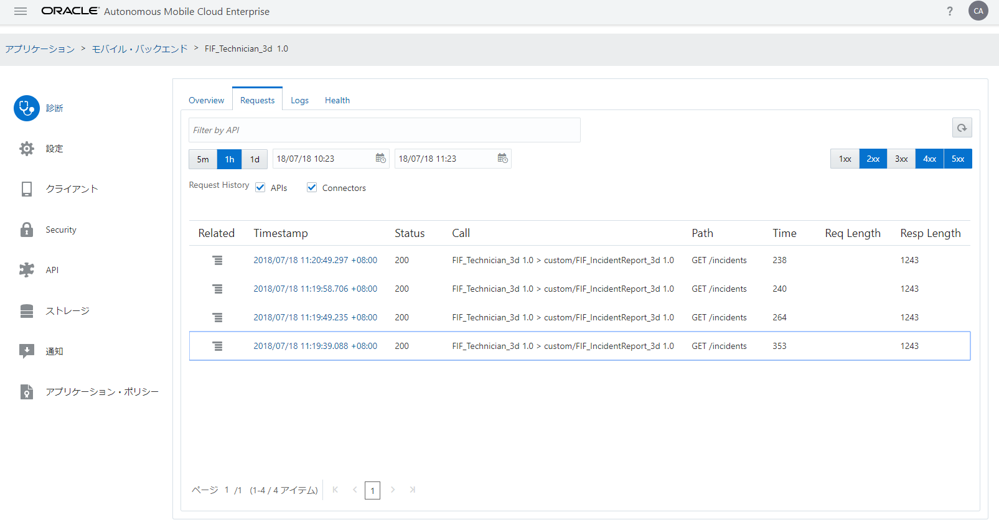
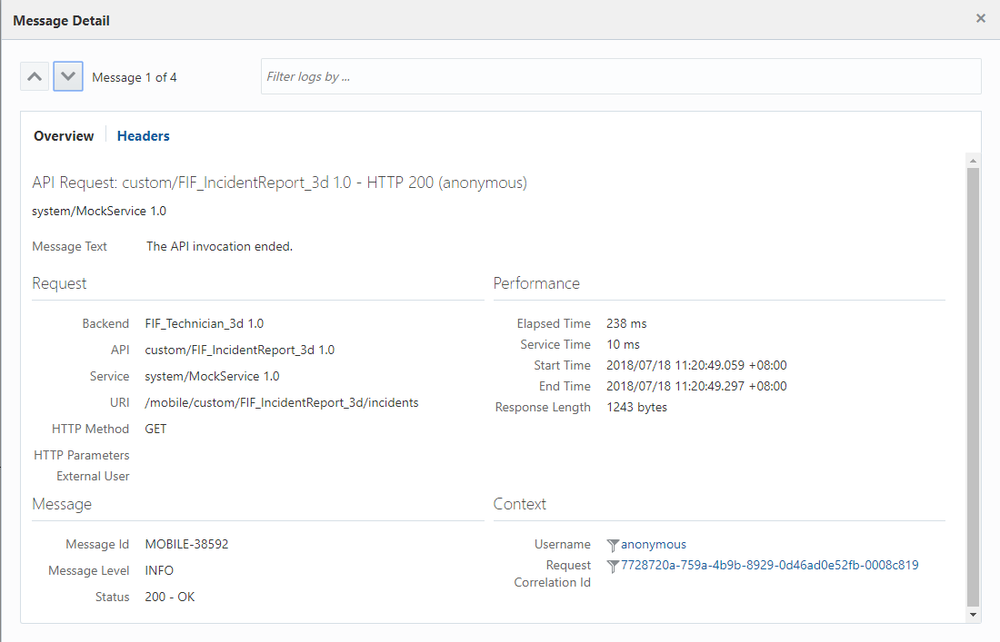
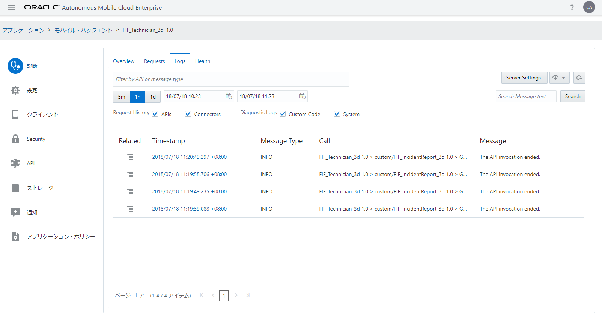
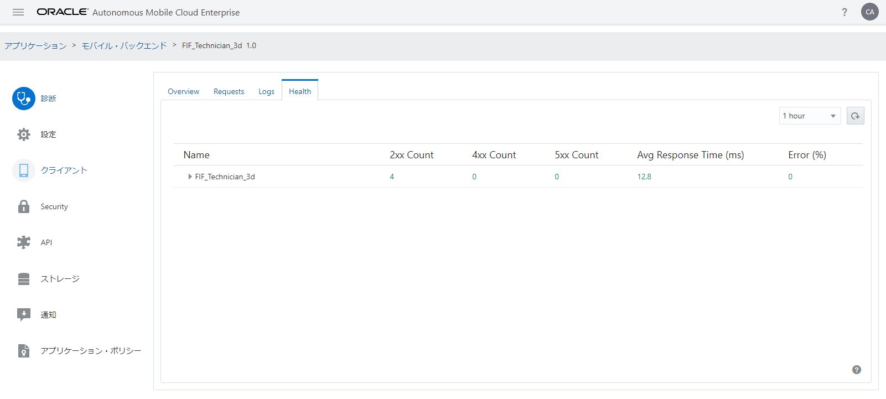

## モバイル・バックエンドの診断情報の確認

モバイル・バックエンドの「診断」ページでは、モバイル・バックエンドに関連付けられたリソースに対するアクセスの履歴やパフォーマンスの情報を取得できます。

**Step-1** モバイル・バックエンド「FIF_Technician_xx」の「診断」ページを開きます。「Overview」タブ・ページには、直近１時間のAPIコールの回数とレスポンス時間がグラフで表示されます。また、グラフの下には、モバイル・バックエンドのヘルス情報が表示されます。

 
<strong>図：モバイル・バックエンドの「診断」ページ － 「Overview」タブ・ページ</strong>

**Step-2** モバイル・バックエンドの「診断」ページの「Requests」タブ・ページには、指定した範囲内（初期状態では直近の１時間）に処理されたリクエストが表形式で一覧できます。レスポンスのHTTPステータス・コードによる絞り込みが可能です。
初期状態では、リクエストが処理できなかったことを表す「4xx」（クライアント・エラー: 400 Bad Requestや401 Unauthorizedなど）と「5xx」（サーバー・エラー: 500 Internal Server Errorや503 Service Unavailableなど）が選択されています。「2xx」をクリックすることで、正常にしょりされたリクエストが表示されます。

 
<strong>図：モバイル・バックエンドの「診断」ページ ― 「Requests」タブ・ページ</strong>

**Step-3** 「Timestamp」列のリンクをクリックすると「Message Detail」ダイアログ・ボックスがポップアップし、リクエストの処理状況やリクエストおよびレスポンスのヘッダーの値を確認できます。

 
<strong>図：「Message Detail」ダイアログ・ボックス</strong>

「Message Detail」ダイアログ・ボックスは、右上の「×」アイコンをクリックすることで閉じることができます。

**Step-4** モバイル・バックエンドの「診断」ページの「Logs」タブ・ページでは、指定した範囲内（初期状態では直近の１時間）に出力されたログ・メッセージが表形式で一覧できます。

 
<strong>図：モバイル・バックエンドの「診断」ページ ― 「Logs」タブ・ページ</strong>

「Timestamp」列のリンクをクリックすると「Message Detail」ダイアログ・ボックスがポップアップし、リクエストの処理状況やリクエストおよびレスポンスのヘッダーの値を確認できます。

**Step-5** モバイル・バックエンドの「診断」ページの「Health」タブ・ページでは、モバイル・バックエンドや関連付けられたAPIの実行状況を確認できます。

 
<strong>図：モバイル・バックエンドの「診断」ページ ― 「Health」タブ・ページ</strong>

