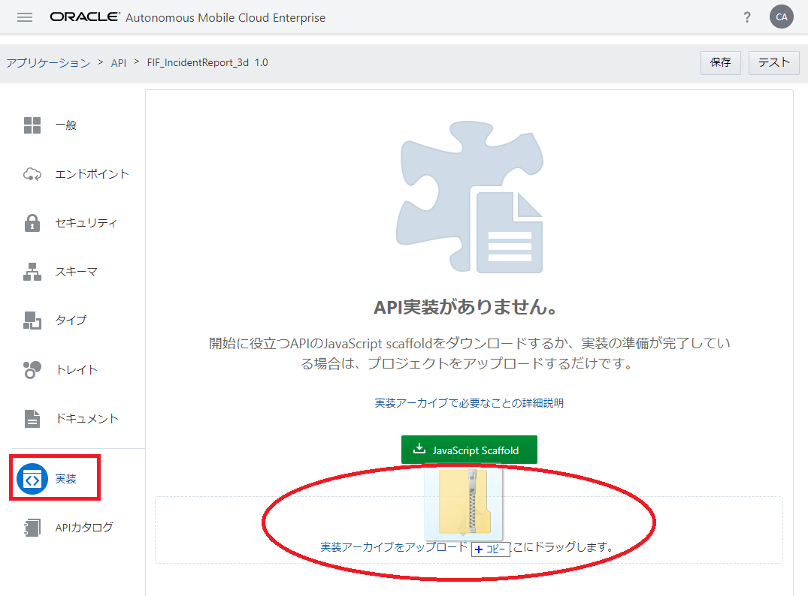
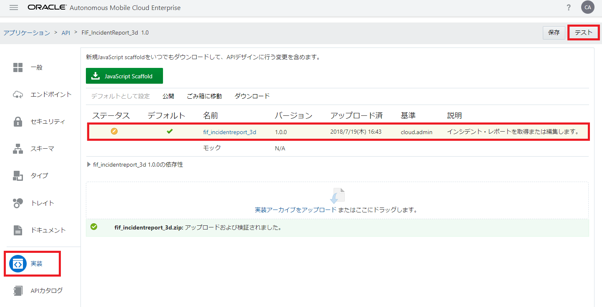
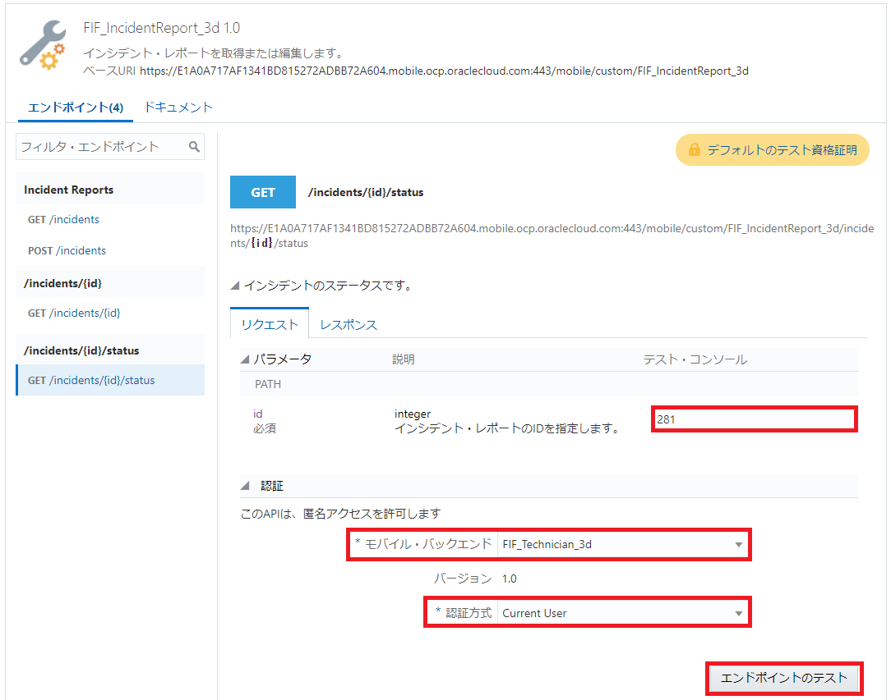
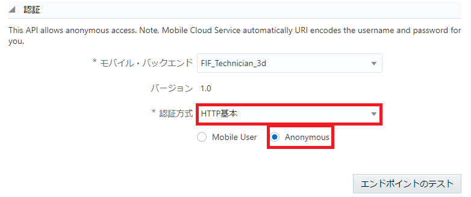
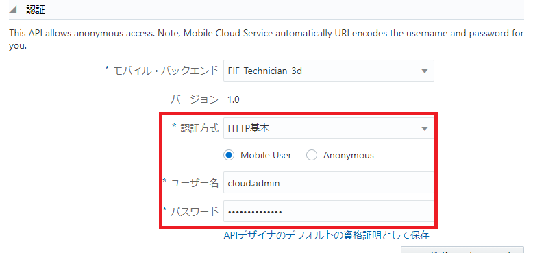
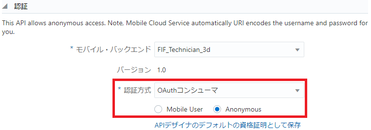
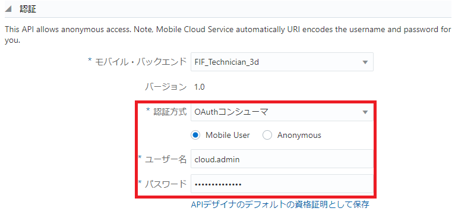
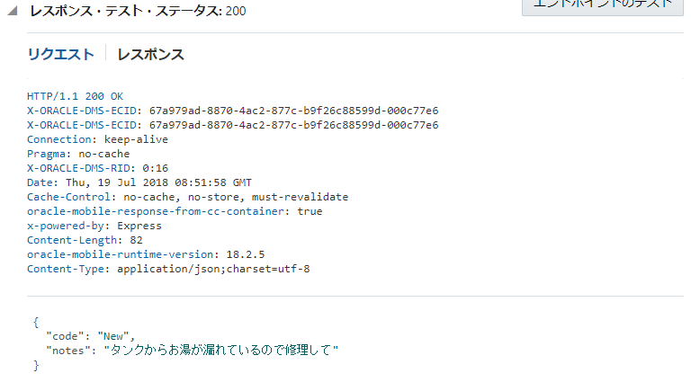

## Node.jsによるAPIの実装

ここではAPIを実装するためにfif_incidentreport_<xx>.jsを編集し、AMCeにアップロードしてテストしてみます。

**Step-1** エンドポイント「GET /incidents/{id}/status」に対応したスタブを変更します。次の例では「result.notes」のテキストを変更し、「result」オブジェクトをログ・メッセージとして書き出す処理を追加しています。

**GET /incidents/{id}/status 変更前**

```javascript
service.get('/mobile/custom/FIF_IncidentReport_3d/incidents/:id/status', function(req,res) {
		var result = {};
		var statusCode = 200;
		if (statusCode == 200){
			var acceptType = req.accepts(['application/json']);
			if (acceptType == 'application/json'){
				result = { "code": "New",
					   "notes": "My hot water tank's model is AB234"
					    };
			}
		}
		res.status(statusCode).send(result);
	});
```

**GET /incidents/{id}/status 変更後**

```javascript
service.get(
  '/mobile/custom/FIF_IncidentReport_xx/incidents/:id/status',
  function(req,res) {
    var result = {};
    var statusCode = 200;
    if (statusCode == 200){
      var acceptType = req.accepts(['application/json']);
      if (acceptType == 'application/json'){
        result = { "code": "New",
          "notes": "タンクからお湯が漏れているので修理して"
        };
      }
    }
    console.log('戻り値: ' + JSON.stringify(result));
    res.send(statusCode, result);
  });
```

>**注意：**マルチ・バイト文字を含む場合、ソース・ファイルfif_incidentreport_<xx>.jsはUTF-8で保存する必要があります。

**Step-2** fif_incidentreport_<xx>フォルダをZIP形式に圧縮します。

**Step-3** AMCeのサービス・コンソールで、カスタムAPI「FIF_IncidentReport_<xx>」のAPIデザイナの「実装」ページを開き、ZIPファイルを「実装アーカイブをアップロードまたはドラッグします。」と書かれたボックスにドラッグします。



<div style="text-align: center;">
<strong>図：fif_incidentreport_<xx>.jsを含むZIPファイルをドラッグ</strong>
</div>

**Step-4** 実装が追加されたら、画面右上の「テスト」ボタンをクリックします。



<div style="text-align: center;">
<strong>図：実装が追加された状態</strong>
</div>

**Step-5** エンドポイント「GET /incidents/{id}/status」をテストします。「id」として適当な整数を指定し、「認証」パネルには次の値を入力します。

**表：エンドポイント「GET /incidents/{id}/status」のテスト**

| 入力項目 | 入力する値                                                         |
| :------- | :----------------------------------------------------------- |
| モバイル・バックエンド     | FIF_Technician_<xx> |
| 認証方式     | 「Current User」、「HTTP基本」または「OAuthコンシューマ」 |



<div style="text-align: center;">
<strong>図：エンドポイント「GET /incidents/{id}/status」のテスト</strong>
</div>



<div style="text-align: center;">
<strong>図：認証方式を「HTTP基本 － Anonymous」と選択した場合</strong>
</div>



<div style="text-align: center;">
<strong>図：認証方式を「HTTP基本 － Mobile User」と選択した場合</strong>
</div>



<div style="text-align: center;">
<strong>図：認証方式を「OAuthコンシューマ － Anonymous」と選択した場合</strong>
</div>



<div style="text-align: center;">
<strong>図：認証方式を「OAuthコンシューマ － Mobile User」と選択した場合</strong>
</div>

入力が終わったら「エンドポイントのテスト」ボタンをクリックします。

**Step-6** レスポンスのHTTPステータス・コードとして200が返ってくることを確認します。また、今回の変更例のようにAPI実装にログ・メッセージの書き出し処理を追加した場合は、モバイル・バックエンドの「診断」ページの「ログ」パネルで、メッセージが出力されていることを確認します。



<div style="text-align: center;">
<strong>図：レスポンスのHTTPステータス・コードとして200が返ってくることを確認</strong>
</div>
